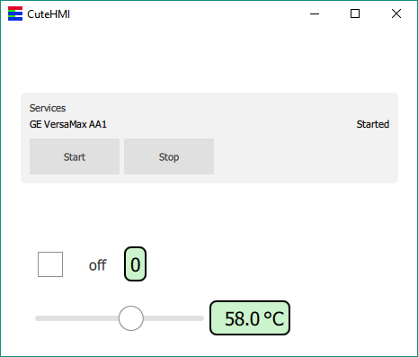

# CuteHMI

[](https://travis-ci.org/michpolicht/CuteHMI)

CuteHMI is an open-source HMI (Human Machine Interface) software written in C++ and QML, using Qt library as a framework.

Note: While most of the project uses Mozilla Public License, v. 2.0, some files are distributed under different licenses.

## Compiling

1. Get the Qt framework. Open-source and commercial editions can be obtained from https://www.qt.io/. Qt can also be shipped with Linux distribution.

2. Modbus components still use libmodbus library (http://libmodbus.org/). On Linux one can run following commands.
```  
git clone git://github.com/stephane/libmodbus.git
cd libmodbus
git checkout f9358460ee1f62bcac716ad0444b3bbe7628b204
./autogen.sh
./configure
make && sudo make install
```  
Compiling libmodbus on Windows can be a bit more tricky. I won't write the instructions here, because if project prevails, it should use *QtSerialBus* module.

3. Open `All.pro` file with *QtCreator* and build it. When apllication starts it shows empty screen.

## Running example

To run *SampleProject* example with *QtCreator* click "Projects" -> "Build & Run" -> "Run" and in the "Command line arguments" box type: `--project="projects/SampleProject.cutehmi.xml" --basedir="../CuteHMI/examples"`.

If anything goes wrong during loading, first check debug output and verify that paths are correct.

Something similar to this should show up on screen.



Two essential files are: `examples/projects/SampleProject.cutehmi.xml` and `examples/QML/Screens/SampleProject/SampleProject.pro`. First one describes project in terms of CuteHMI application. The second one is a standard qmake project file, which can be opened in *QtCreator* for easy edition.
